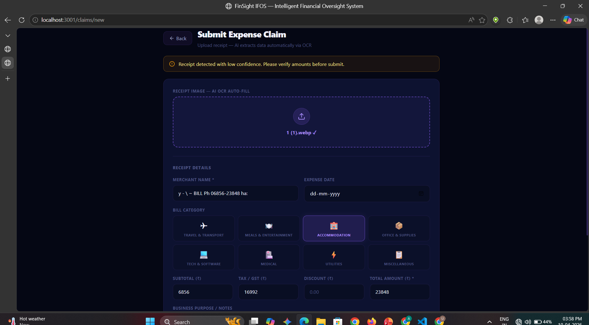

# FinSight IFOS — How to Run

<!-- markdownlint-disable MD022 MD031 MD032 MD033 MD034 MD040 MD056 MD060 -->

**"The Autonomous Finance Advisor"**  
Intelligent Billing & Reimbursement Management System  
Problem Statement 11 | Balfour Beatty | U Akhila, ATME College of Engineering

---

## What This System Does (from PPT)

| Feature | Implementation |
|---|---|
| Triple-Check Validation | OCR vs user input vs Tax API — `analytics.py /triple-check/{id}` |
| Regulatory-as-Code | Policies in DB, enforced in `claims.py` auto-approve logic |
| Immutable Trust Architecture | SHA-256 hash chain in `audit_log` table |
| Asynchronous AI Processing | Background OCR via multi-engine service on port 8002 |
| Auto-reads bills (PDF/JPG/PNG) | Google Vision + Gemini 1.5 Document AI |
| Multi-Page Support | Processes up to 5 pages using `pdfplumber` |

---

## Step 1 — Run Database Migrations

Go to **supabase.com → Your Project → SQL Editor**

Run these files in order:
1. Paste `database/migrations/001_initial_schema.sql` → click Run
2. Paste `database/migrations/002_rls_policies.sql` → click Run

---

## Step 2 — Open VS Code

Open the `finsight_v3` folder in VS Code.  
Press `Ctrl + `` ` `` to open terminal.

---

## Step 3 — Run Manually in Terminal (PowerShell)

### 3.0 Stop Docker Ports First (important)

If Docker stack is running, ports `3000`, `8000`, `8001`, `8002` are already occupied.

Run from project root:

```powershell
docker compose stop web api-gateway fraud-service ocr-service
```

If you want Docker and manual mode together, use alternate ports shown below.

---

### 3.1 Terminal 1 — Backend API (port 8000)

```powershell
cd services\api-gateway
python -m venv venv
venv\Scripts\activate
pip install -r requirements.txt
uvicorn main:app --reload --host 127.0.0.1 --port 8010
```
✅ Open: http://localhost:8000/docs

---

### 3.2 Terminal 2 — OCR Service (port 8002)

```powershell
cd services\ocr-service
python -m venv venv
venv\Scripts\activate
pip install -r requirements.txt
uvicorn main:app --host 127.0.0.1 --port 8012
```
✅ Open: http://localhost:8002/docs

**This is the service that auto-reads your bills:**
- Upload any PDF, JPG, PNG, WEBP, TIFF
- Powered by: Google Vision + **Gemini 1.5 Flash Document AI**
- Extracts: merchant name, date, GST amount, total, tax, and line items
- Handles: Handwritten receipts, ticket PNRs, and multi-page utility bills
- Category auto-detected (travel/meals/hotel/etc)
- Carbon footprint auto-calculated

---

### 3.3 Terminal 3 — Fraud Detection (port 8001)

```powershell
cd services\fraud-service
python -m venv venv
venv\Scripts\activate
pip install -r requirements.txt
uvicorn main:app --reload --host 127.0.0.1 --port 8011
```
✅ Open: http://localhost:8001/docs

---

### 3.4 Terminal 4 — Frontend (port 3000)

```powershell
cd apps\web
npm install
npm run dev
```
✅ Open: http://localhost:3001

---

### 3.5 Alternate Ports (if WinError 10013 still appears)

If any port is blocked, use these alternate ports instead. Run in separate terminals:

#### 3.5.1 Terminal 1 — API Gateway (port 8010)

```powershell
cd services\api-gateway
venv\Scripts\activate
pip install -r requirements.txt
uvicorn main:app --reload --host 127.0.0.1 --port 8010
```
✅ Open: http://localhost:8010/docs

#### 3.5.2 Terminal 2 — OCR Service (port 8012)

```powershell
cd services\ocr-service
venv\Scripts\activate
pip install -r requirements.txt
uvicorn main:app --host 127.0.0.1 --port 8012
```
✅ Open: http://localhost:8012/docs

#### 3.5.3 Terminal 3 — Fraud Service (port 8011)

```powershell
cd services\fraud-service
venv\Scripts\activate
pip install -r requirements.txt
uvicorn main:app --reload --host 127.0.0.1 --port 8011
```
✅ Open: http://localhost:8011/docs

#### 3.5.4 Terminal 4 — Frontend (port 3001)

Create/update `apps\web\.env.local`:
```
NEXT_PUBLIC_API_URL=http://localhost:8010
```

Then run:
```powershell
cd apps\web
npm install
npm run dev
```
✅ Open: http://localhost:3001

---

**Summary of Alternate URLs:**
- API docs: http://localhost:8010/docs
- Fraud docs: http://localhost:8011/docs
- OCR docs: http://localhost:8012/docs
- App: http://localhost:3001

---

## Step 4 — First Login

1. Go to http://localhost:3000
2. Sign up with your email
3. Dashboard loads automatically

### Set Your Role (for demo)
1. Go to clerk.com → Dashboard → Users → click your user
2. Click **Public Metadata** → Edit → paste:
   ```json
   {"role": "manager", "tier": "platinum"}
   ```
3. Sign out → sign back in → sidebar updates

---

## Step 5 — Load Demo Data (optional)

After signing up with 2-3 accounts:
1. Supabase → SQL Editor
2. Paste `database/seed.sql` → Run

---

## How Bill Auto-Reading Works

When you go to **Submit Claim** and upload any bill:

```
PDF/JPG/PNG/WEBP uploaded
        ↓
OCR Service (port 8002 or 8012)
        ↓
Google Vision + pdfplumber (Multi-page)
        ↓
Gemini 1.5 AI Parser Logic:
  • Merchant & Date detection
  • GST / Tax breakdown
  • Subtotal / Discount / Total
  • Ticket PNRs & Service IDs
  • Category & ESG Carbon score
        ↓
Form auto-filled in browser
        ↓
Triple-Check Validation runs
        ↓
Fraud Detection scores the claim
        ↓
Auto-approved if clean + under ₹5,000
```

---

## All URLs

| URL | Purpose |
|---|---|
| http://localhost:3000 | FinSight app (login → dashboard) |
| http://localhost:3000/claims/new | Submit claim with bill upload |
| http://localhost:3000/manager | Approve/reject pending claims |
| http://localhost:3000/auditor | Blockchain audit log + verify |
| http://localhost:3000/cfo | Analytics, ESG, forecasting |
| http://localhost:3000/compliance | Compliance reports |
| http://localhost:8000/docs | Backend API documentation |
| http://localhost:8001/docs | Fraud service API docs |
| http://localhost:8002/docs | OCR service API docs |

**If using alternate ports (Step 3.5), replace with:**
- http://localhost:8010/docs — Backend API (port 8010)
- http://localhost:8011/docs — Fraud service (port 8011)
- http://localhost:8012/docs — OCR service (port 8012)
- http://localhost:3001 — Frontend app (port 3001)

---

## Common Errors

| Error | Fix |
|---|---|
| `venv\Scripts\activate` fails | Run in CMD not PowerShell. Or: `Set-ExecutionPolicy RemoteSigned` |
| Module not found | Make sure `(venv)` shows in terminal before pip install |
| CORS error | Check FRONTEND_URL in `services/api-gateway/.env` = `http://localhost:3000` |
| 401 Unauthorized | Sign out and back in. Token expired. |
| Table doesn't exist | Run SQL migrations in Supabase first |
| WinError 10013 / Port in use | Stop Docker service on same port: `docker compose stop web api-gateway fraud-service ocr-service` OR change to alternate ports in Step 3.5 |
| OCR returns empty | Check `GOOGLE_CLOUD_VISION_KEY` and `GEMINI_API_KEY` in `services/ocr-service/.env`. |
| PDF shows "Uploaded file is empty" | Re-export or re-download PDF, then upload again |
| PDF is slow | Multi-page PDFs use Document AI; up to 5 pages are processed sequentially |

---

## PPT Solution Checklist

- [x] **Inefficient Management** → Centralized dashboard, all claims in one place
- [x] **Manual Error Risks** → AI-OCR auto-fills all fields, 0% manual typing
- [x] **Compliance Gaps** → Regulatory-as-Code policies, auto-block non-compliant
- [x] **Opaque Workflows** → SHA-256 blockchain audit trail, full transparency
- [x] **Financial Leakage** → Triple-Check validation + fraud detection
- [x] **Audit Readiness** → Immutable audit log, exportable compliance reports
- [x] **Reimbursement Speed** → Auto-approve claims < ₹5,000 in seconds
- [x] **Strategic Insights** → CFO dashboard with ESG, forecasting, vendor analysis
